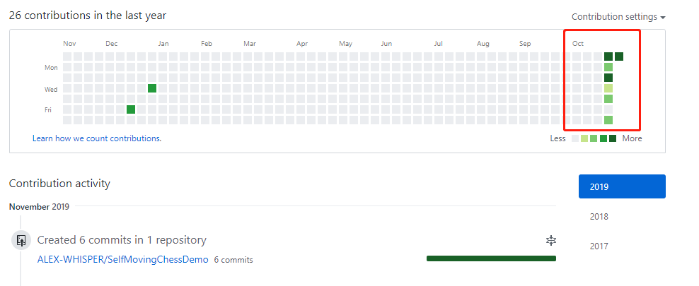
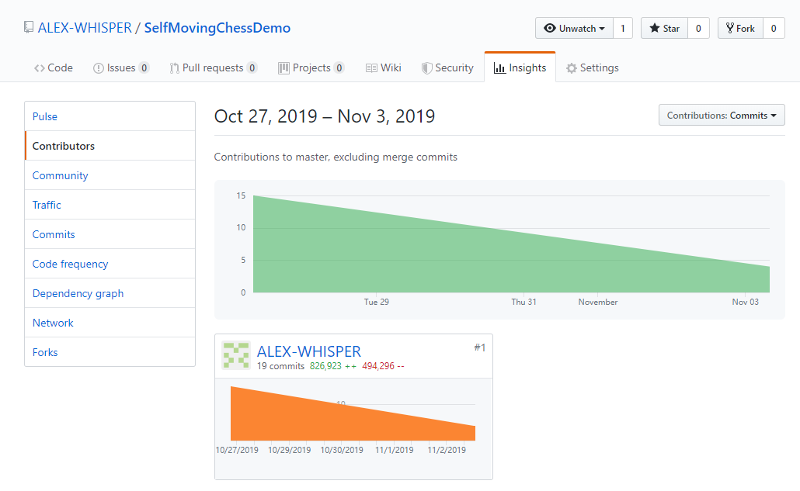

## 自走棋 demo 概述(2019/11/03)

+ 综述
	> 本 demo 共有5轮战斗，前3轮模拟野怪关卡，后2轮模拟与随机玩家对战，5轮结束后自动进入游戏结束界面。受到美术资源限制，demo中拥有完整动画状态的棋子共有4类，野怪棋子以引擎内置的基础模型代替。

+ 主流程
	- 游戏开始 ``开场效果``
	
	- 准备阶段 ``暂定 15s, 开始阶段结束后进入，此阶段内允许购买、排布己方棋子``

	- 战斗阶段 ``暂定 30s, 准备阶段结束后进入，双方棋子自动进行相互战斗 ``

	- 回合结算 ``战斗阶段结束后进入，根据胜负结果进行数据统计结算``

	- 游戏结束 ``游戏经过指定的回合数后结束，进入后可选择重载关卡``

+ 主要数据统计

	- 玩家等级/人口

	- 经验值

	- 当前等级下的经验值上限

	- 金币值

	- 游戏昵称

	- 当前回合数

	- 双方参与战斗的棋子数量

	- 本阶段的剩余时间

+ 主要规则
	- 按阶段

		* 准备阶段
			> + 进入准备阶段时，可购买的棋子列表将**自动刷新（未锁条件下）**，期间允许进行**棋子的买卖**与**位置排布**，棋子允许放置的范围包括备战区与战斗区域
			> 
			> + 备战区可放置棋子的数量上限为 8，战斗区域可放置的棋子数量上限为当前等级，即人口数
			> 
			> + 若准备阶段结束时，玩家仍未排列好战斗棋子，则游戏将**根据当前人口数（等级）**，从备战区内选择指定数量的棋子置入战斗区域
        
        * 战斗阶段
        	> + 允许进行棋子买卖，**不允许**从备战区向战斗区拖入棋子
        	> 
        	> + 当某一方棋子被团灭，则跳过战斗阶段的剩余时间，直接进入回合结算阶段

		* 回合结算
			> + 金币
			> 	* 基础收入：前3回合为回合数+1，之后均为5
			> 	* 胜利奖励：+1（非野怪回合）
			> 	* ~~连胜/连败奖励~~
			> 	* ~~利息：总金币数/10 向下取整~~

			> + 经验值：从第3回合起，每回合结束后经验值+1

			> + 经验值上限
			
	- 按功能
		* 购买与出售
			+ 购买
				> 打开购物车，可在任意阶段从列表中选择指定角色进行购买。每轮进入准备阶段前，可购买列表将自动刷新，也可选择消耗2金币进行手动刷新，若对列表上锁，则自动、手动刷新均不可用

			+ 出售
				> 作用范围仅为**备战区**内的棋子，选择棋子后，点击右下方出售按钮即完成出售，获得相应金币

		* 移动
            > + 拖拽棋子，选择棋盘内空闲（格位变蓝）的位置后放下，若位置正被占用（格位变红），放下后棋子将返回先前位置
            
            > + 准备阶段中，棋子的移动范围为整个棋盘的空置位置；战斗阶段中，棋子的移动范围为备战区内的空置位置

		* 自动入场
			> 准备阶段结束，己方战斗区域尚无任何棋子，或已有棋子的数量小于当前人口数，则游戏将根据当前人口数，从备战区内由前至后，选择相应数量的棋子进入战斗区，保证战斗区中的棋子数量等于当前人口

		* 敌方棋子
			> 每回合进行战斗阶段时，敌方棋子将被自动随机创建

        * 战斗
        	> 战斗阶段，双方若当前棋子数量一致，则一一配对进行战斗；若数量不一致，则数量多的那方未能配对的棋子，将随机选取一名友军的目标，对其进行合围

		* 统计
			> 上述 **主要数据统计** 中列出的属性将作为 UI 元素实时显示
		
+ 开发时间
	> + 本项目仓库于 2019/10/27 日创建，开发时长为一周，由本人独自进行全部开发工作。下图为 github 的提交截图：
	> + 
	> 
	> + 
	> + [github 仓库地址](https://github.com/ALEX-WHISPER/SelfMovingChessDemo)

+ demo 预览
	- 附件中 **demo Recording** 文件内为我本人录制的demo运行视频
	
	- 附件中 **output** 文件中为 Unity 导出至 Windows 的输出文件，解压后打开 .exe 文件即可运行游戏