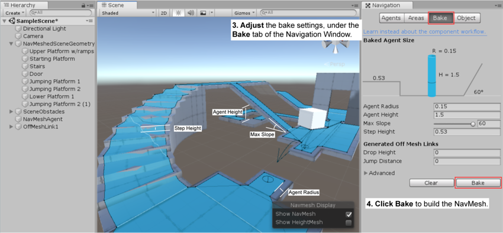

### 自走棋demo技术梳理

+ Drag and Drop
	- OnMouseDrag
		* namespace: MonoBehaviour
		
		* Called when the user has clicked and holding down the mouse

		* Sent to all scripts attached to the ** Collider ** or ** GUIElement **

	- Raycast hit
	
	- MousePosition
		* screen position
		```
        var screenPos = Input.MousePosition;
        ```
        
        * world position
        ```
        var worldPos = Camera.main.ScreenToWorldPoint(screenPos);
        ```
        
        * ** Object follow mouse while dragging **
        	+ get the object transform's z pos in screen point
        	```
            var zCoord = Camera.main.WorldToScreenPoint(transform.position).z;
            ```
            
            + set zCoord to mouse screen position
            ```
            var screenPos = Input.MousePosition;
            screenPos.z = zCoord;
            ```
            
            + convert mouse screen point to world point, then set it to the object
            ```
            var targetPos = Camera.main.ScreenToWorldPoint(screenPos);
            transform.position = targetPos;
            ```

+ Navigation
	- Navmesh
		* A class
		* Do spacial queries, like pathfinding
		* An approximation of the walkable surface
		* Shown as a blue overlay

	- Navmesh Baking
		>  根据关卡图形生成对应 Navmesh 的过程。`` The process of creating a Navmesh from the level geometry ``
		
		* 收集所有标记为 **Navigation Static** 的 GameObject 的 **Render Mesh** 和 **Terrain** 作为必要信息
        > Collects the Render Meshes and Terrains of all GameObjects which are marked as Navigation Statics(Navigation Window->Oject) 
		
		* 根据收集的信息，生成 Navmesh
			> ``Processes the collected to create Navmesh``

		* 烘培步骤:
			+ **Select** scene geometry
			
			+ **Check** Navigation Static(Navigation->Object)
			
			+ **Adjust** bake settings(Navigation->Bake)
				- Agent Radius:  how close the agent center can get to a wall or a ledge `` 可以贴多近的墙/边缘 ``
				
				- Agent Height: how low the spaces are that the agent can reach `` 可以通过多低的空间 ``
				
				- Max Slope: how steep the ramps are that the agent walk up `` 可以爬多陡的坡 ``
				
				- Step Height: how high obstructions are that the agent can step on `` 可以跨越多高的障碍物 ``

            
			+ **Click** Bake button

	- [Navigation Areas and Costs](https://docs.unity3d.com/Manual/nav-AreasAndCosts.html)
    
	- Navmesh Agent
		* Avoid each other
		
		* Avoid obstacle
		
		* Property
			+ Radius: calculate collisions between obstacles and other agents for avoidance

			+ Area Mask: Which area types the agent will consider when finding a path. 仅在指定类型的区域内进行寻路
	
	- Navmesh Obstacle
		* Movable around the surface og the Navmesh
		
		* Only affect agent's avoidance behaviour rather than pathfinding
		 > 绘制路径时将忽略障碍物，即路径可能与障碍物相交，但沿路径移动时将绕开障碍物

		* Enable **Carve** when sationary
			> 对于固定静止的障碍物，勾选 Carve 属性，Navmesh上的相应位置将被刻出一个洞，此时 agent 在被多个障碍物围堵的情况下仍能找到其他路径，否则可能被卡在障碍物之间

		* Diable **Carve** when constantly moving
			> 对于一直处于运动状态的障碍物，不勾选 Carve 属性

	- [NavmeshComponents](https://github.com/Unity-Technologies/NavMeshComponents)

+ **Display 3D Model as UI element using Render Texture**
	- Create a new Render Texture
		> In Project window -> right click -> Create -> Render Texture, name it **RT_0**
		
    - Create a 3d Object which needs to be rendered
    	> set its layer, call it **Layer_RT_0**
    
	- Create Camera which renders the object as texture
		* Target Texture 
			> attach to **RT_0**
		
		* Culling Mask 
			> Select **Layer_RT_0**

	- Create a Raw Image which displays the rendered texture
		* Texture: attach to ** RT_0 **

+ LookAt
	> Rotate the transform so that its forward vector points at some point or other game object's transform

	+ Health bar of 3d object look at camera constantly
	```
    transform.LookAt(
    	transform.position + Camera.main.transform.rotation * Vector3.forward, 
    	Camera.main.transform.rotation * Vector3.up
    );
    ```

+ Singleton